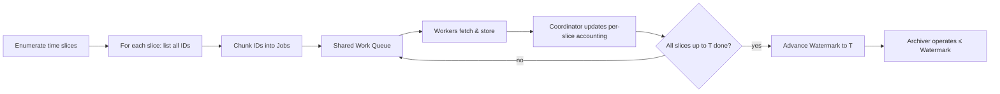
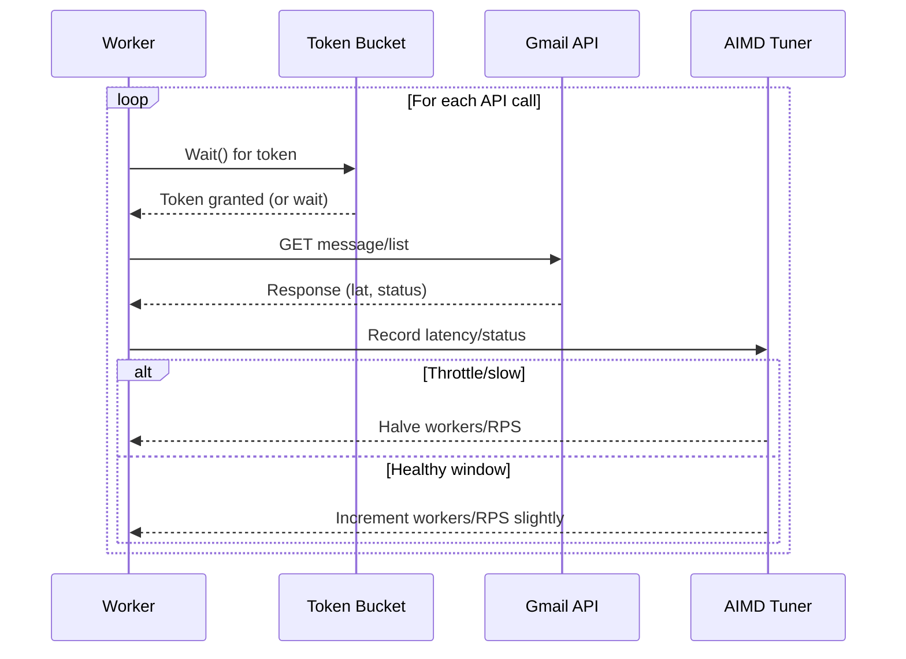

# ADR-004: Sync Concurrency, Batching, and Progress Semantics for Gmail → SQLite (with Separate Archiver)

**Status:** Accepted (Draft for implementation)

**Date:** 2025-08-07

**Owners:** Mike Schinkel (product/architecture)

**Related ADRs:**

* ADR-002: SQLite sharding strategy (referenced)
* ADR-003: Gmail metadata storage (referenced)

> **Note on code**: All code herein is **illustrative** (pseudocode/Go-like) to make the design concrete. It is **not** normative. We will finalize implementation separately and align with house style (e.g., single return with `goto end`).

---

## 1. Context & Problem

We are building a Go-based synchronizer that reads Gmail messages and stores them in a SQLite archive for long-term search/analysis. **Archiving** (deleting or de-labelling messages from Gmail after they are safely captured) is a **separate job** that must only operate on fully synced ranges.

We need a design that:

* Maximizes throughput without getting throttled or flagged by Gmail.
* Keeps failure “blast radius” small and makes restarts deterministic.
* Allows **concurrent** processing where slices may finish **out of order**, yet overall **progress** advances in proper chronological order.
* Automatically isolates pathological content/items ("bad messages") without operator intervention.
* Scales with sharded SQLite archives and remains idempotent.

---

## 2. Decision (Overview)

We will:

1. **Slice by time** (days/weeks/months; configurable) and discover all message **IDs** per slice.
2. Split each slice’s IDs into **fixed-size batches** and push them onto a **shared, in-process work queue**.
3. Pull jobs off the queue with a **bounded worker pool**. All Gmail API calls (list/get/delete) pass through a **token-bucket rate limiter** whose target RPS is tuned via **AIMD** (Additive-Increase/Multiplicative-Decrease).
4. Write parsed messages to SQLite using **WAL mode**, **small transactions**, and **one writer per shard**. Inserts are **idempotent** (UPSERT by Gmail `id` and/or RFC `Message-ID`).
5. Maintain an **Ordered Frontier Commit** (OFC) for progress: only when **all** slices up to time **T** are fully processed (including isolating any bad messages) do we advance the account **watermark** to **T**. The **archiver** processes only up to the watermark.
6. On repeated batch failures, we **recursively split** failing batches (binary split) until the failure scope is a **single message ID**; mark such IDs as **bad** in metadata with reason/counters and continue. We alert if bad-rate or metadata storage usage crosses thresholds.

This avoids fragile overlap heuristics (e.g., “48h window”) and provides deterministic, resumable progress akin to TCP’s **cumulative ACK**.

---

## 3. Glossary

* **Slice**: A time range \[Start, End) used for scoping discovery and progress semantics.
* **Job**: A batch of message IDs (e.g., 200–500) derived from a slice.
* **Dispatcher / Work Queue**: In-process producer/consumer channel for `Job`s.
* **Ordered Frontier Commit (OFC)**: Progress (watermark) advances only to the greatest `End` time such that **all** slices ending ≤ that time are fully finished.
* **Bad message**: A single Gmail message that deterministically fails processing; recorded in metadata and excluded from blocking progress.
* **RPS**: Requests per second (API call rate).

---

## 4. Constraints & Non-Goals

* **Do not** archive (delete/remove labels) inside the sync job. Archiver is a separate phase.
* Respect Gmail’s variable, undocumented practical rate tolerances by keeping to **adaptive** ceilings.
* SQLite writes must be robust (WAL), **idempotent**, and work with **shards**.
* We will not adopt an external/persistent queue in v1; an **in-process** queue suffices. We’ll keep the design portable so we can migrate to persistent jobs later, but _**ONLY**_ if needed.

---

## 5. Detailed Design

### 5.1 Slicing & Progress (Ordered Frontier Commit)

**Why slices?** They bound failure impact, enable deterministic restarts, and make human reasoning/observability easier.

**Granularity:**

* Default **daily** for very large mailboxes
* Default **weekly** for moderate
* Default **monthly** for small
  (Adjustable; can dynamically split further if needed.)

**Flow:**

1. For each slice, list **all message IDs** via Gmail query (`after:`/`before:`) with paging (e.g., `maxResults=500`).
2. Chunk IDs into `Job`s (e.g., 200–500 IDs per job).
3. The coordinator tracks per-slice totals/outstanding jobs. When all jobs in a slice are finished (including isolated bad IDs), the slice is **done**.
4. The **watermark** advances to the largest `End` for which **every slice with `End ≤ that`** is done.

#### 5.1.1. Ordered Frontier Commit:



**Determinism:** The OFC model makes progress monotonic, avoids overlap heuristics, and cleanly separates concurrency from ordering.

---

### 5.2 Work Queue, Concurrency, Throttling

**Work queue:** In-process `Dispatcher` with a buffered channel of `Job`s and a `WaitGroup`. The dispatcher closes the queue when idle (all enqueued jobs—including dynamically added split-jobs—are completed).

**Workers:** A bounded pool (e.g., start 8, cap 32) that pulls `Job`s, fetches each message’s full content, parses, and hands off to the shard writer.

**Rate control:**

* **Token-bucket limiter**: bucket refills at **r** tokens/sec (target RPS), capacity **b** tokens (burst). Each API call consumes a token; if empty, the caller waits. This caps sustained load while allowing short bursts.
* **AIMD tuner**: periodically increase workers/RPS additively (e.g., +1 worker, +0.5 RPS) while health is good; on 429/403 or p95 latency exceedance, **halve** workers/RPS and back off with jitter. This converges near the service’s comfortable capacity without a priori thresholds.

**Initial defaults (tunable at runtime):**

* List `maxResults`: 500
* Job size (IDs/batch): 300 (range 200–500)
* Workers: start 8, max 32
* RPS: start 4.0, max 16.0; burst capacity ≈ 1.5×RPS
* SQLite txn: 100 messages **or** \~8–16 MB per txn, whichever first

#### 5.2.1 Concurrency & Rate Limiting:



---

### 5.3 Failure Handling & Bad-Message Isolation

**Goal:** Never let a small number of problematic items block progress.

**Strategy:**

1. If a job (batch of IDs) fails **after retries**, **split** it into two smaller jobs and re-enqueue both (binary search).
2. Continue until a job contains **one ID**; if that also fails deterministically, mark it **bad** and count the job as finished (bad). The slice can complete without that message.
3. Store bad-message metadata: `{messageId, reason, firstSeen, lastTried, retryCount}`.

**Stall detection:** Workers emit heartbeats (pages processed, last token). A supervisor cancels & re-enqueues jobs that fail to heartbeat within **T** (5–10 min). Jobs keep a retry budget (e.g., 5); exceeding budget forces a split.

**Alerting & guardrails:**

* **Warn** when `bad_count / processed_count ≥ 0.2%` over a 10k message window.
* **Critical** when ≥ 1% or spikes (e.g., >200 bad in 1h).
* Track **metadata usage**; if estimated usage ≥ **50%** of budget → warn; ≥ **80%** → critical. Optionally send a self-email (rate-limited) for visibility.

**Why this works:** Binary-splitting gives \~O(log N) isolation steps per bad item (N = batch size). Progress remains monotonic.

---

### 5.4 SQLite Write Strategy

* **WAL mode**, `synchronous=NORMAL` (or `FULL` during finalization phases).
* **One writer per shard** to avoid contention; write via a single goroutine per shard.
* **Small transactions** (100 msgs or 8–16 MB) to cap redo on crash and keep checkpoints fast.
* **Idempotent upserts** keyed by Gmail `id` and RFC `Message-ID` (when absent, generate a stable surrogate). Keep both Gmail `id` & `threadId` for API ops and relational joins.
* Works with ADR-002 sharding: router selects shard by policy (time/size), writer commits locally, reads can `ATTACH`/`UNION ALL` when needed.

---

### 5.5 Sync vs Archive (Separation of Concerns)

* **Sync** guarantees durable storage of message content & metadata in SQLite, plus progress in metadata (watermark).
* **Archive** (a separate job) deletes or removes labels **only up to the watermark**. It batches deletes (e.g., 300 IDs/call) and retries independently.
* This separation reduces blast radius and simplifies reasoning (no “fetch-then-delete” coupling).

---

### 5.6 Metadata Model (Account-Level)

Minimal but sufficient, stored in the account and outside the archive DB (see ADR-003):

* `watermark`: highest fully-synced timestamp (exclusive).
* `slices[]` (optional/ephemeral): status per slice (`start`, `end`, `totalJobs`, `doneJobs`, `badJobs`, `outstanding`), last heartbeat.
* `badMessages{ id → {reason, firstSeen, lastTried, retryCount} }`.
* `counters`: processed, retried, throttled, bad, etc. (windowed).
* `limits`: metadata budget (bytes), alert thresholds; last-alert timestamps for rate-limiting notifications.

> We will estimate metadata storage by serialized JSON lengths unless the store gives exact usage.

---

### 5.7 Dynamic Split (Optional) at Enumeration Time

While listing IDs for a slice, if we observe that paging is **too deep** (e.g., >20 pages at `maxResults=500`), we may **split the remaining time** of that slice in half and enumerate each half independently. This keeps job creation latency predictable. No merging is required; both halves are just additional slices tracked by OFC.

> Once Message IDs are enumerated, we **do not** convert back to time ranges—jobs are **Message ID batches** only.

---

### 5.8 Ordering & Determinism

* DB insert order is irrelevant; we store true dates (`internalDate`, RFC dates) for queries.
* **Progress** order is handled exclusively by OFC; concurrency cannot advance the watermark out of order.
* Restarts are deterministic: re-enumerate from the **watermark forward** (or resume unfinished slices), re-generate jobs, and continue. Upserts make replays harmless.

---

## 6. Alternatives Considered

1. **Overlap window after watermark** (e.g., always reprocess last 48–96h):

    * ✅ Simple to implement; tolerates minor out-of-order arrival.
    * ❌ Non-deterministic; can miss edge cases outside the window or reprocess too much. We prefer OFC.

2. **Queue time ranges instead of ID batches**:

    * ✅ Conceptually clean.
    * ❌ Requires re-listing & paging at split time; less precise and more waste. We prefer ID batches once IDs are known.

3. **Single-threaded sequential sync**:

    * ✅ Simplest and safest for throttling.
    * ❌ Far too slow for large mailboxes; poor utilization.

4. **Fetch then delete in same process**:

    * ✅ Reduces intermediate state.
    * ❌ Increases blast radius and complexity; failure modes multiply. We keep archiver separate.

5. **Gmail History API for incremental sync**:

    * ✅ Efficient change feed for ongoing deltas.
    * ❌ History IDs are not guaranteed to be durable beyond a few hours 
    * ❌ More complex semantics and edge-cases (gaps, retention).

6. **External/persistent queue (e.g., SQLite-backed jobs, Redis, SQS)**:

    * ✅ Durability and horizontal scale.
    * ❌ Overhead/complexity not needed for v1; design remains portable if we need it later.

---

## 7. Risks & Mitigations

* **Throttling / API changes** → AIMD + token bucket, aggressive backoff on 429/403; config caps.
* **Pathological messages** → Binary split isolation + bad-message registry.
* **Metadata store pressure** → Usage estimation + warning/critical alerts; potential migration to dedicated store if needed.
* **Shard writer contention** → Single writer per shard, bounded batch size, WAL.
* **Coordinator bugs** → Unit tests against OFC invariants; property tests for reordering/random failures.

---

## 8. Observability & Alerts

* Metrics: processed/sec, p50/p95/p99 latency per API, error rates, split count, retries, bad rate, metadata usage.
* Logs: job lifecycle, split decisions, stall detection, alert emissions.
* Alerts: bad-rate thresholds, metadata thresholds, sustained throttling.
* Optional self-email notification (rate-limited: e.g., once/hour per condition).

---

## 9. Illustrative Code (non-normative)

### 9.1 Types

```go
// A time slice for progress semantics
type Slice struct {
    ID            int
    Start, End    time.Time // [Start, End)
    TotalJobs     int64
    DoneJobs      int64
    BadJobs       int64
    Outstanding   int64 // = TotalJobs - DoneJobs - BadJobs
}

// A job: a batch of message IDs
type Job struct {
    SliceID int
    IDs     []string // 200–500 typical
    Tries   int
}

// A bad message registry entry
type BadMessage struct {
    ID         string
    Reason     string
    FirstSeen  time.Time
    LastTried  time.Time
    RetryCount int
}
```

### 9.2 Dispatcher (work queue)

```go
type Dispatcher struct {
    jobs chan Job
    wg   sync.WaitGroup
}

func NewDispatcher(buf int) *Dispatcher {
    return &Dispatcher{jobs: make(chan Job, buf)}
}
func (d *Dispatcher) Enqueue(j Job) { d.wg.Add(1); d.jobs <- j }
func (d *Dispatcher) Done()         { d.wg.Done() }
func (d *Dispatcher) Jobs() <-chan Job { return d.jobs }
func (d *Dispatcher) CloseWhenIdle()   { go func(){ d.wg.Wait(); close(d.jobs) }() }
```

### 9.3 Coordinator (Ordered Frontier Commit)

```go
type Coordinator struct {
    mu    sync.Mutex
    byID  map[int]*Slice
    ends  []time.Time // sorted distinct slice.End values
    persistWatermark func(context.Context, time.Time) error
}

func (c *Coordinator) AddSlice(s *Slice) {
    c.mu.Lock(); defer c.mu.Unlock()
    if c.byID == nil { c.byID = make(map[int]*Slice) }
    c.byID[s.ID] = s
    c.ends = append(c.ends, s.End)
    sort.Slice(c.ends, func(i,j int) bool { return c.ends[i].Before(c.ends[j]) })
}

func (c *Coordinator) JobDone(ctx context.Context, sliceID int, good, bad int) error {
    var frontier time.Time
    c.mu.Lock()
    if s := c.byID[sliceID]; s != nil {
        s.DoneJobs += int64(good)
        s.BadJobs  += int64(bad)
        s.Outstanding = s.TotalJobs - s.DoneJobs - s.BadJobs
    }
    // advance frontier: largest End where all slices with End<=that are finished
    doneUpTo := time.Time{}
    for _, end := range c.ends {
        all := true
        for _, sl := range c.byID {
            if !sl.End.After(end) && sl.Outstanding > 0 { all = false; break }
        }
        if all { doneUpTo = end } else { break }
    }
    frontier = doneUpTo
    c.mu.Unlock()

    if !frontier.IsZero() { return c.persistWatermark(ctx, frontier) }
    return nil
}
```

### 9.4 Worker, splitting & bad isolation

```go
func processJob(ctx context.Context, j Job, g GmailClient, lim *Limiter, enqueue func(Job), markBad func(string, error)) (good, bad int) {
    ok, err := processBatch(ctx, j.IDs, g, lim) // fetch+store; internal retries
    if ok {
        good = 1
        goto end
    }
    if len(j.IDs) == 1 {
        markBad(j.IDs[0], err)
        bad = 1
        goto end
    }
    // split and re-enqueue halves; current job completes when children do
    mid := len(j.IDs) / 2
    left := Job{SliceID: j.SliceID, IDs: append([]string(nil), j.IDs[:mid]...), Tries: j.Tries+1}
    right:= Job{SliceID: j.SliceID, IDs: append([]string(nil), j.IDs[mid:]...), Tries: j.Tries+1}
    enqueue(left)
    enqueue(right)
end:
    return
}
```

### 9.5 Token Bucket + AIMD (concept)

```go
type Tuner struct {
    mu              sync.Mutex
    workers         int
    minW, maxW      int
    qps             float64
    minQPS, maxQPS  float64
}
func (t *Tuner) Snapshot() (int, float64) { t.mu.Lock(); defer t.mu.Unlock(); return t.workers, t.qps }
func (t *Tuner) Inc() { t.mu.Lock(); if t.workers<t.maxW {t.workers++}; if t.qps<t.maxQPS {t.qps+=0.5}; t.mu.Unlock() }
func (t *Tuner) Halve(){ t.mu.Lock(); if t.workers>t.minW {t.workers=max(t.minW, t.workers/2)}; t.qps=maxf(t.minQPS, t.qps/2); t.mu.Unlock() }

// Limiter.Wait() consumes a token; it refills at current qps and allows a small burst.
```

---

## 10. Test & Acceptance Criteria

* **Correctness**

    * Progress (watermark) never advances past a slice that has unfinished jobs.
    * Bad-message isolation allows slices to complete despite individual bad IDs.
    * Restart from any crash resumes deterministically from the watermark forward.
* **Performance**

    * Achieve stable throughput without sustained throttling (AIMD converges).
    * SQLite writers maintain steady commit rate with chosen batch sizes.
* **Resiliency**

    * Stall detector rescues stuck jobs; retries/splits function as specified.
    * Alerts fire when bad-rate or metadata usage crosses thresholds; self-email throttles appropriately.

---

## 11. Operational Notes

* Expose knobs via config/flags: slice granularity, job size, initial/max workers, initial/max RPS, retry budgets, alert thresholds.
* Export metrics and logs; maintain dashboards for RPS, latencies, retries, splits, bad rates, watermark.
* Archiver runs on an independent cadence; it must read the current watermark before each batch.

---

## 12. Open Questions / Future Work

* Switch to a **persistent job queue** if we need multi-process scale or crash-proof job state (but not likely necessary.)
* Add **Gmail History API** for incremental sync after initial backfill (with OFC still gating progress).
* Consider **per-label** slicing as an additional dimension if certain labels dominate volume.
* Explore **adaptive job sizes** based on observed error/latency distributions.
* Evaluate **back-pressure** from shard writers to throttle job dispatch when queues back up.

---

## 13. Parameter Defaults (Initial)

* Slice granularity: **weekly** (large mailboxes: daily; small: monthly)
* List page size: **500**
* Job (ID batch) size: **300**
* Workers: **start 8**, cap **32**
* RPS: **start 4.0**, cap **16.0**, burst ≈ 1.5×
* SQLite txn size: **100 msgs** or **8–16 MB**
* Retry budget per job: **5** attempts; then forced split
* Stall timeout: **10 minutes** without heartbeat
* Alerts: bad-rate **warn 0.2%**, **crit 1%** (10k-window); metadata usage **warn 50%**, **crit 80%**

---

### End of ADR-004
