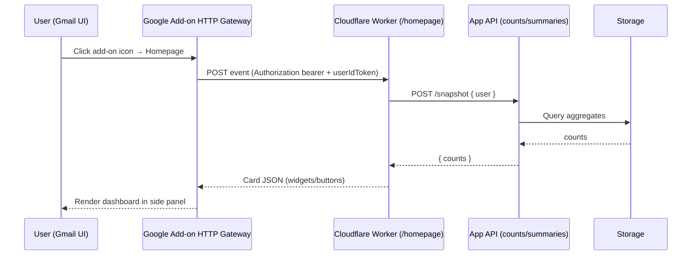

# ADR-008: Gmail "Inbox Dashboard" via HTTP Add-on + Cloudflare Worker

**Status:** Proposed → Draft (PoC)

**Date:** 2025-08-08

**Owners:** Gmover App team

---

## 1. Context & Goals

We want a **Gmail dashboard** add-on that shows at-a-glance widgets (time-sensitive mail, deals, events, newsletters, etc.). The add-on **should not** directly read Gmail data for the PoC; instead it calls our backend which already integrates with the Gmail API and computes the counts/summaries. UI must be fast, low-scope, and easily evolvable.

### Goals

* Deliver a **Homepage** dashboard inside Gmail using the **HTTP (alternate runtime)** model.
* Keep OAuth scopes **minimal** (no restricted Gmail scopes for PoC).
* Use **Cloudflare Workers** as the HTTP endpoint, returning **Card Framework JSON**.
* Keep the add-on stateless; real work happens in our backend.

### Non‑Goals (PoC)

* No message-level actions inside the add-on (labels/moves/etc.).
* No background processing; add-ons run on user-triggered events.

---

## 2. Decision

* Implement the add-on as a **Google Workspace Add-on (Gmail surface)** using the **HTTP runtime**.
* Host the add-on handler on a **Cloudflare Worker** (`/homepage`).
* The Worker fetches precomputed user-specific counts from our web API and renders **Card JSON**.
* Minimal scopes: `gmail.addons.execute` + `userinfo.email`. (Add others later only if necessary.)
* Identity: verify Google-provided **ID tokens** (system & user) **later**; disabled in PoC. We will verify in production.

---

## 3. Architecture Overview



---

## 4. Security & OAuth

### Tokens (HTTP runtime)

* **System token** (Authorization: Bearer …) identifies Google as the caller. Verify audience (endpoint URL) & issuer.
* **User ID token** (`authorizationEventObject.userIdToken`) identifies the end-user. Verify audience = **OAuth client ID** of the add-on (from the Marketplace SDK HTTP deployment) and issuer `accounts.google.com`.

**PoC:** We set `VERIFY_TOKENS = false` in Worker env to skip verification while wiring UI. **Production:** flip to `true` and enforce both verifications using `jose`.

### Scopes Strategy

* **PoC:**

    * `https://www.googleapis.com/auth/gmail.addons.execute` (required host integration)
    * `https://www.googleapis.com/auth/userinfo.email` (identify user)
* **Later (optional):** granular Gmail scopes if we render Gmail content directly inside the add-on.

### OAuth Client IDs (who needs what?)

* **Add-on HTTP runtime** has an **OAuth client ID** managed in the Google Cloud project where you enable **Google Workspace Marketplace SDK** and create an **HTTP Deployment**. This client ID is used as the **audience** to verify `userIdToken`.
* **End users do not create client IDs.** They install the add-on; we (the publisher) own the Cloud project and its OAuth client(s).
* **Multiple client IDs?** Recommended to keep **separate OAuth clients** for distinct apps/flows:

    * One for the **Add-on HTTP deployment** (used only for ID token audience).
    * One for our **web app/backend** if it performs user consent flows against the Gmail API (see ADR-002 for token management). Distinct clients ease auditing and consent screens.
* **Environments:** create separate HTTP deployments (and optionally separate client IDs) for **dev/test/prod**.

---

## 5. Implementation

### 5.1 Project Layout (Cloudflare Worker)

```
/ (repo root)
  wrangler.toml
  package.json
  /src
    index.ts          # Worker entry (serves / and POST /homepage)
```

### 5.2 `package.json` (excerpt)

```json
{
  "name": "gmail-dashboard-worker",
  "private": true,
  "version": "0.1.0",
  "type": "module",
  "scripts": {
    "dev": "wrangler dev",
    "deploy": "wrangler deploy"
  },
  "dependencies": {
    "jose": "^5.9.2"
  },
  "devDependencies": {
    "wrangler": "^3.75.0",
    "typescript": "^5.5.4"
  }
}
```

### 5.3 `wrangler.toml`

```toml
name = "gmail-dashboard-worker"
main = "src/index.ts"
compatibility_date = "2025-08-08"

[vars]
SELF_URL = "https://gmail-dashboard-worker.<your-subdomain>.workers.dev"
# Point to the simple HTML we host at Worker root for PoC
DASHBOARD_APP_URL = "https://gmail-dashboard-worker.<your-subdomain>.workers.dev/"
# Backend API that returns counts; leave empty to use stub data
DASHBOARD_API = ""
# From the Marketplace SDK HTTP deployment page once created
OAUTH_CLIENT_ID = ""
# PoC defaults
VERIFY_TOKENS = "false"
SYSTEM_TOKEN_AUD = ""  # optional override in prod when verifying system token
```

> For local dev, you can also set secrets via `wrangler secret put NAME` (for anything sensitive). The above are non-sensitive PoC values.

### 5.4 `src/index.ts` (TypeScript Worker)

```ts
// src/index.ts
import { createRemoteJWKSet, jwtVerify, JWTPayload } from "jose";

export interface Env {
  SELF_URL: string;
  DASHBOARD_APP_URL: string;
  DASHBOARD_API: string; // optional; if blank, we use stub data
  OAUTH_CLIENT_ID: string; // audience for userIdToken verification
  VERIFY_TOKENS: string; // "true" to enforce token checks
  SYSTEM_TOKEN_AUD?: string; // optional override for system token audience in prod
}

const GOOGLE_JWKS = createRemoteJWKSet(new URL("https://www.googleapis.com/oauth2/v3/certs"));

async function verifyIdToken(token: string, audience: string | string[]): Promise<JWTPayload> {
  const { payload } = await jwtVerify(token, GOOGLE_JWKS, {
    audience,
    issuer: ["https://accounts.google.com", "accounts.google.com"],
  });
  return payload;
}

function cardResponse(counts: Record<string, number>, appUrl: string) {
  return {
    renderActions: {
      action: {
        navigations: [
          {
            pushCard: {
              header: { title: "Inbox Dashboard" },
              sections: [
                { widgets: [{ decoratedText: { topLabel: "Time-sensitive", text: String(counts.time_sensitive ?? 0) } }] },
                { widgets: [{ decoratedText: { topLabel: "Deals",          text: String(counts.deals ?? 0) } }] },
                { widgets: [{ decoratedText: { topLabel: "Events",         text: String(counts.events ?? 0) } }] },
                { widgets: [{ decoratedText: { topLabel: "Newsletters",    text: String(counts.newsletters ?? 0) } }] },
                {
                  widgets: [
                    {
                      buttonList: {
                        buttons: [
                          { text: "Open full dashboard", onClick: { openLink: { url: appUrl } } }
                        ]
                      }
                    }
                  ]
                }
              ]
            }
          }
        ]
      }
    }
  } as const;
}

function htmlPlaceholder(selfUrl: string): Response {
  const html = `<!doctype html>
<html lang="en">
  <meta charset="utf-8" />
  <meta name="viewport" content="width=device-width, initial-scale=1" />
  <title>Inbox Dashboard (PoC)</title>
  <style>
    body{font:16px system-ui,-apple-system,Segoe UI,Roboto,Ubuntu,Cantarell,Noto Sans,sans-serif;margin:0;padding:2rem;line-height:1.4}
    .card{max-width:680px;margin:auto;padding:1.25rem;border:1px solid #e5e7eb;border-radius:12px;box-shadow:0 4px 20px rgba(0,0,0,.06)}
    h1{font-size:1.4rem;margin:.2rem 0 1rem}
    code{background:#f8fafc;border:1px solid #e5e7eb;border-radius:6px;padding:.15rem .35rem}
    .row{display:flex;gap:1rem;flex-wrap:wrap}
    .pill{padding:.4rem .7rem;border-radius:999px;background:#f1f5f9;border:1px solid #e2e8f0}
  </style>
  <div class="card">
    <h1>Inbox Dashboard (PoC)</h1>
    <p>This is a simple placeholder page. The Gmail add-on calls <code>POST /homepage</code> to render cards. You can also host your full dashboard UI here later.</p>
    <div class="row">
      <span class="pill">Worker: <code>${selfUrl}</code></span>
      <span class="pill">Endpoint: <code>/homepage</code></span>
    </div>
    <p>Test it:</p>
    <pre><code>curl -X POST ${selfUrl}/homepage -H 'content-type: application/json' -d '{}'</code></pre>
  </div>
</html>`;
  return new Response(html, { headers: { "content-type": "text/html; charset=utf-8" } });
}

export default {
  async fetch(request: Request, env: Env): Promise<Response> {
    const url = new URL(request.url);
    const method = request.method.toUpperCase();

    // 1) Simple HTML placeholder at root
    if (method === "GET" && (url.pathname === "/" || url.pathname === "/index.html")) {
      return htmlPlaceholder(env.SELF_URL || `${url.origin}`);
    }

    // 2) Gmail Homepage endpoint (HTTP runtime)
    if (method === "POST" && url.pathname === "/homepage") {
      let event: any = {};
      try { event = await request.json(); } catch {}

      const verify = (env.VERIFY_TOKENS || "false").toLowerCase() === "true";
      const authObj = event?.authorizationEventObject || {};

      // Optional system token verification (prod)
      if (verify) {
        const authz = request.headers.get("authorization") || "";
        const systemToken = authz.startsWith("Bearer ") ? authz.slice(7) : "";
        if (!systemToken) return new Response("Missing bearer token", { status: 401 });
        try {
          // Audience recommendation: the exact endpoint URL
          const expectedAud = env.SYSTEM_TOKEN_AUD || `${url.origin}${url.pathname}`;
          await verifyIdToken(systemToken, expectedAud);
        } catch (e) {
          return new Response("Invalid system token", { status: 401 });
        }
      }

      // Optional user identity (for fetching per-user data)
      let userEmail = "unknown";
      if (verify && authObj.userIdToken && env.OAUTH_CLIENT_ID) {
        try {
          const u = await verifyIdToken(authObj.userIdToken, env.OAUTH_CLIENT_ID);
          userEmail = (u.email as string) || (u.sub as string) || "unknown";
        } catch {}
      }

      // Fetch counts from backend (or stub)
      let counts = { time_sensitive: 0, deals: 0, events: 0, newsletters: 0 };
      if (env.DASHBOARD_API) {
        try {
          const r = await fetch(`${env.DASHBOARD_API.replace(/\/$/, "")}/snapshot`, {
            method: "POST",
            headers: { "content-type": "application/json" },
            body: JSON.stringify({ user: userEmail })
          });
          if (r.ok) {
            const data = await r.json();
            if (data?.counts && typeof data.counts === "object") {
              counts = { ...counts, ...data.counts };
            }
          }
        } catch {
          // swallow in PoC
        }
      }

      const body = JSON.stringify(cardResponse(counts, env.DASHBOARD_APP_URL || `${url.origin}/`));
      return new Response(body, { headers: { "content-type": "application/json; charset=utf-8" } });
    }

    return new Response("Not found", { status: 404 });
  }
};
```

---

## 6. Google Workspace Marketplace: HTTP Deployment

### 6.1 Create the HTTP Deployment

1. In **Google Cloud Console**, select (or create) the project for this add-on.
2. Enable **Google Workspace Marketplace SDK**.
3. Open **Marketplace SDK → HTTP Deployments** → *Create deployment*.
4. Use this minimal manifest (replace the URL with your Worker URL):

```json
{
  "oauthScopes": [
    "https://www.googleapis.com/auth/gmail.addons.execute",
    "https://www.googleapis.com/auth/userinfo.email"
  ],
  "addOns": {
    "common": {
      "name": "Inbox Dashboard (PoC)",
      "logoUrl": "https://gmail-dashboard-worker.<your-subdomain>.workers.dev/icon.png",
      "homepageTrigger": {
        "runFunction": "https://gmail-dashboard-worker.<your-subdomain>.workers.dev/homepage"
      }
    },
    "gmail": {},
    "httpOptions": {
      "granularOauthPermissionSupport": "OPT_IN"
    }
  }
}
```

5. Click **Install** on the deployment to add it to your account (developer install).
6. Open Gmail, click the add-on icon in the right side panel → the **Homepage** renders from your Worker.

### 6.2 Where to find `OAUTH_CLIENT_ID`

* On the **HTTP Deployments** detail page you’ll see an **Authorization** section listing the **OAuth client ID**. Copy that value into `wrangler.toml` → `OAUTH_CLIENT_ID` for token verification (when enabled).
* **End users do not need a client ID.** Only the publisher needs this when building/verifying the add-on.

### 6.3 Distribution Plan

* **PoC / internal:** keep it unpublished or **private** to our Workspace domain.
* **Public:** complete OAuth app verification; if later we request **restricted Gmail scopes**, budget for additional security review.

---

## 7. Ops & Testing

### Local / Dev

```bash
npm i
npm run dev
# test JSON endpoint
curl -sS -X POST http://127.0.0.1:8787/homepage -H 'content-type: application/json' -d '{}' | jq
```

### Deploy

```bash
npm run deploy
```

### Quick sanity checks

* `GET /` returns the HTML placeholder.
* `POST /homepage` returns Card JSON with stub counts.
* Gmail add-on icon opens the Homepage without extra consents beyond basic host/identity.

---

## 8. Alternatives Considered

* **Apps Script runtime**: Faster to start but couples UI generation with Apps Script; we prefer polyglot and infra we control (Workers) + simpler deployments.
* **Full web app inside add-on (no backend)**: Would require Gmail data scopes to compute counts; we want to minimize scopes and keep compute in our backend.
* **Durable Objects / D1 (stateful)**: Useful later (e.g., per-user cache); out-of-scope for PoC.

---

## 9. Future Work

* Implement **compose** and **message-open** contextual cards.
* Add **Refresh** action using HTTP action callbacks (after we finalize action routing for HTTP runtime).
* Server-side cache snapshots; optionally scheduled Worker to precompute.
* Add granular Gmail scopes if rendering message-derived detail inside the add-on.
* Telemetry: latency, error rate, anonymized usage metrics.

---

## 10. Appendix

### 10.1 Example `curl` (production-like event payload placeholder)

```bash
curl -X POST "$SELF_URL/homepage" \
  -H 'content-type: application/json' \
  -d '{"authorizationEventObject": {}}'
```

### 10.2 Widget ideas (PoC)

* Time-sensitive (due dates parsed)
* Trip/event emails next 7 days
* Deals/promotions count
* Newsletters (unread last 48h)
* Buttons: “Open full dashboard”, future “Filter in Gmail”

---

**End of ADR-008**
