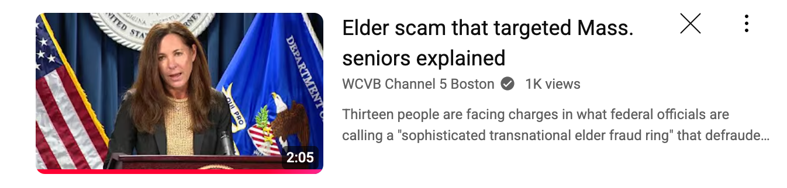
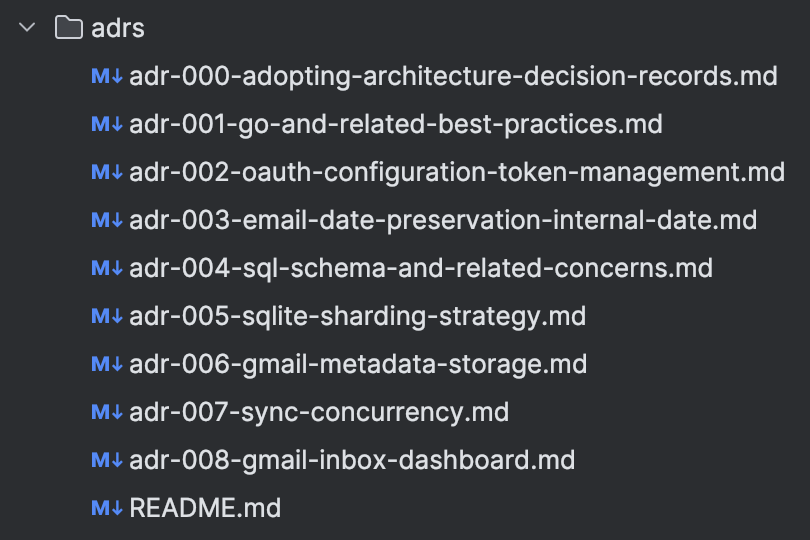
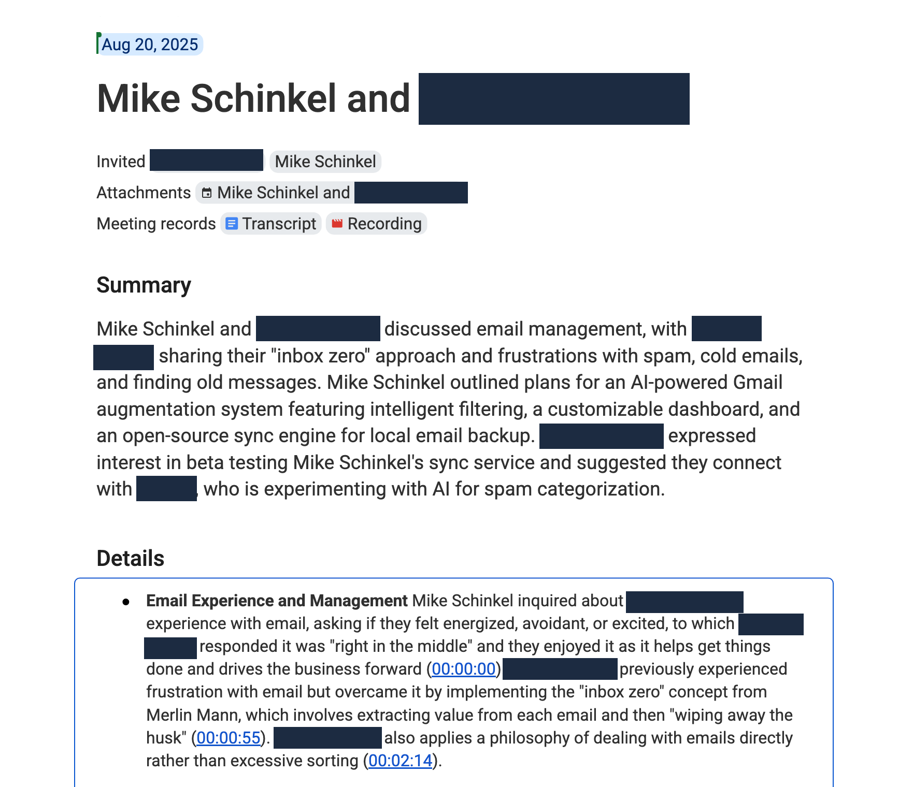
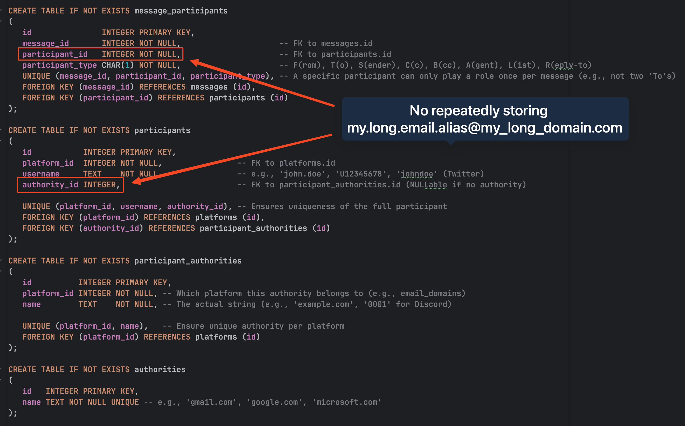
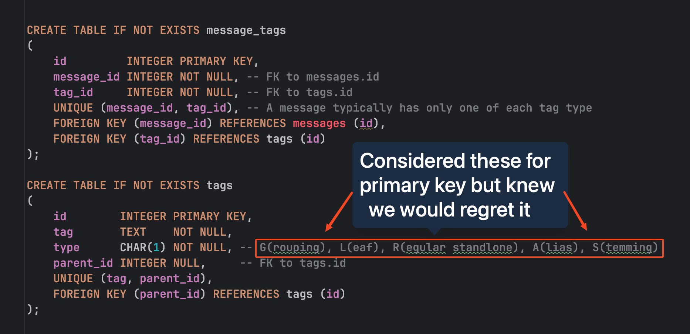
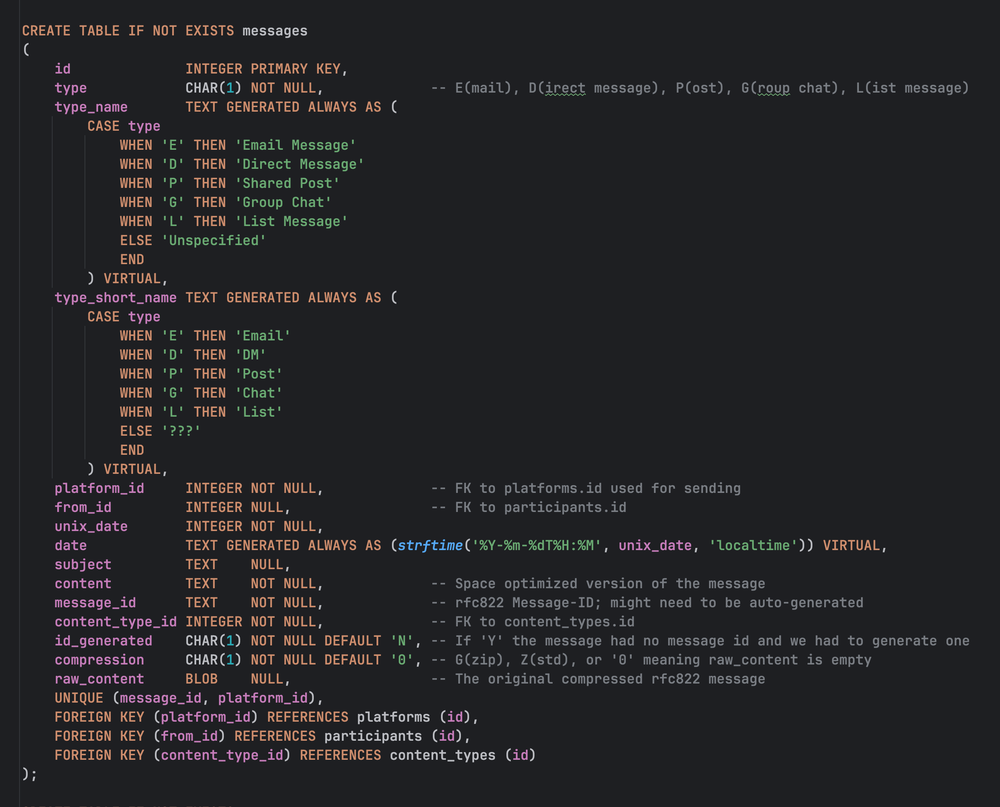
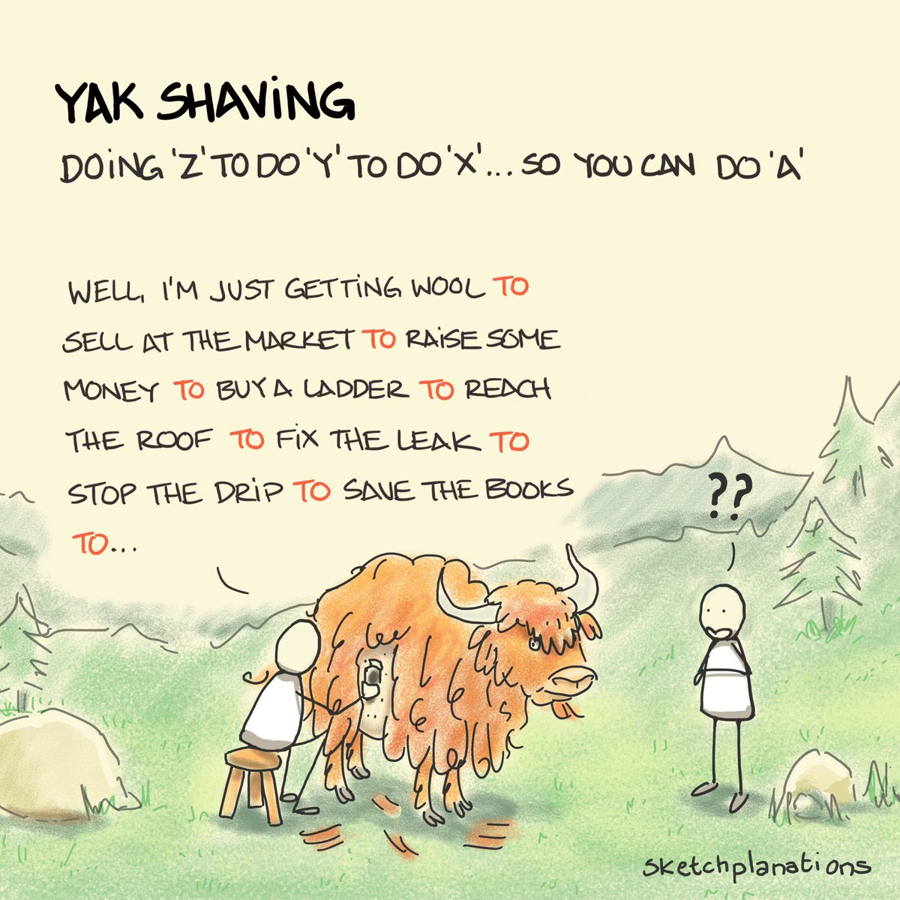
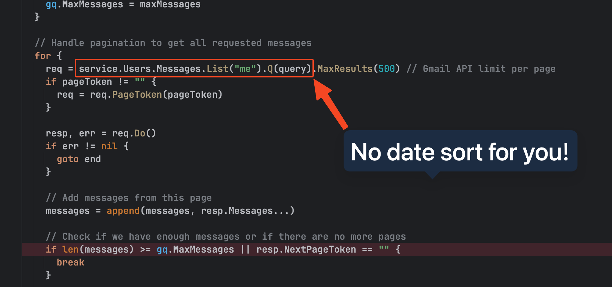
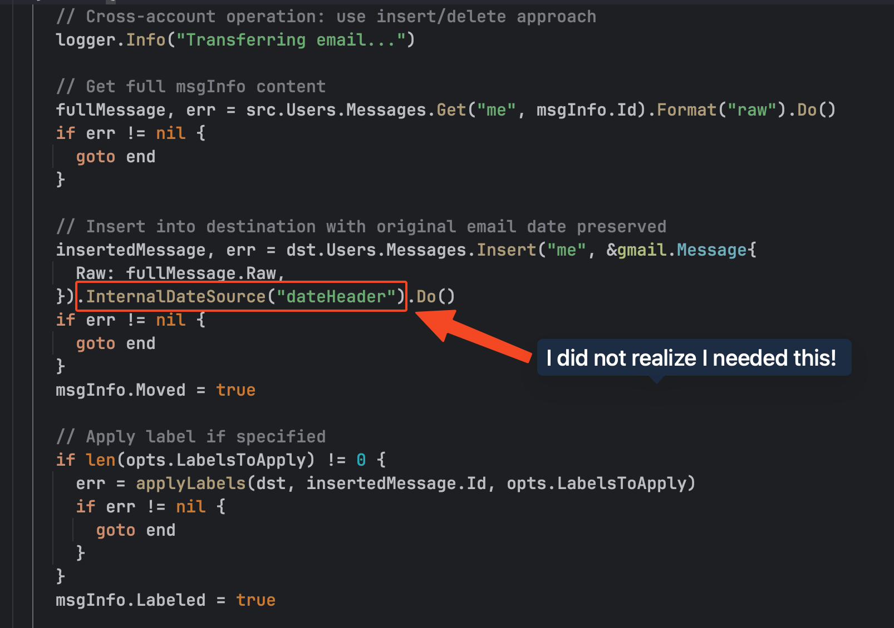
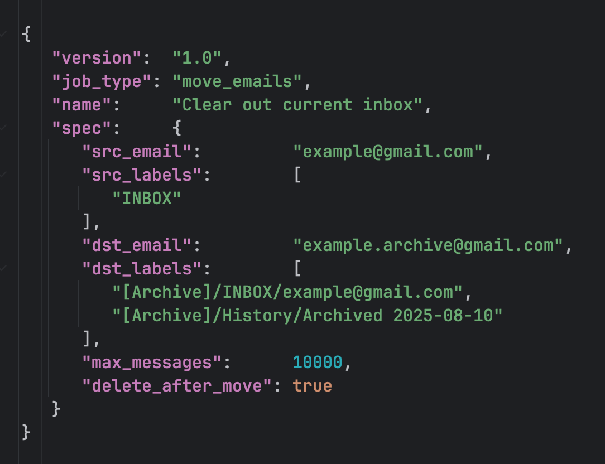

# My Building in Public Tweets


## [Day 15](https://x.com/mikeschinkel/status/1959076233297240280)

``` 
Day 15 — Elder Fraud is REAL! 😡

No heart to tweet about #gmover today.

My 86 yr old dad lost $50k in 2 days to a deep fake of me "in jail" and "lawyer" who scammed him for all he's worth.

WARN YOUR PARENTS; SHARE WIDELY!

Explained: https://www.youtube.com/watch?v=PUmajOogkhs

#buildinpublic

```



## [Day 14](https://x.com/mikeschinkel/status/1958726444835906012)

```
Day 14 — Architecture Decisions Records 

ADRs are a great way to not forget why you made a technical decision.

Teams in my past rarely had the discipline to write them, but as a solo founder I can decide to. 

Now with AI though, I look forward to writing them!

#buildinpublic

```



## [Day 13](https://x.com/mikeschinkel/status/1958338020043850023)

```
Day 13 — Customer Discovery Insights

Interviewed a heavy Gmail User today. He is a Merlin Mann "Inbox Zero" disciple. Biggest pain is spam and cold emails. Also, worried that Google holds the keys to all his email and might deny access someday. 

#GMover will definitely solve the latter. And maybe also the former.
```



## [Day 12](https://x.com/mikeschinkel/status/1957996769557569580)

```
Day 12 — Minimal storage, searchable, no loss

I plan for #gmover to compress the full RFC 5322 message AND store a searchable body.

Raw preserves everything. Searchable strips HTML, signatures, and quoted text which is great for AI.

Complete fidelity AND fast search. #gmail

```


## [Day 11](https://x.com/mikeschinkel/status/1957268264171491538)

```
Day 11 — How to store 10+ years of email?

I want #gmover to archive a decade of your #gmail, but that's HUGE disk space. So I'm leaning heavily into normalization.

No repeatedly storing long email addresses and domains. Break them apart, reference by ID. Storage size matters.
```



## [Day 10](https://x.com/mikeschinkel/status/1956911978997264446)

```
Day 10 — So no to clever database designs

Since #Gmover plans to sync and archive #gmail to Sqlite, we need a long-lived schema to hold 10+ years but still optimized for search.  

I considered creative primary keys to avoid joins, but experience told me no.

Integer Keys FTW!
```



## [Day 9](https://x.com/mikeschinkel/status/1956520014527279301)

```
Day 9 — Your email should be yours

#gmover's plans to archive your gmail to an optimized SQLite database file. 

Not PST, not even JSON, CSV, or some other proprietary format. SQLite means universal access, true ownership, query with any SQL tool. 

Using #gmail should not lock you in.
```


## [Day 8](https://x.com/mikeschinkel/status/1956096923615813699)

```
Day 8 — So hard to avoid Yak Shaving 

I should be working on #gmover for #gmail, but after constantly correcting Claude I decided to write an MCP Server and an LLM Proxy to gain more control. This has been a day's long rabbit hole.

Am I the only founder who does this? 😩

```



## [Day 7](https://x.com/mikeschinkel/status/1955839413331878216)

```
Day 7 — Do you Backup or Archive your Gmail?

Please elaborate, especially if you use a 3rd party tool.
[_] I don't, but I should
[_] Who keeps old emails?!?
[_] I use Google Takeout
[_] I use a 3rd party tool

#gmover #gmail
```


## [Day 6](https://x.com/mikeschinkel/status/1955472309919056236)

```
Day 6 — Gmail API has no email date sort option.

If your code assumes any order, you have a bug.

It works until it doesn't. Then as luck would have it your code will likely do something destructive. And unrecoverable.

Just one more thing I learned writing #gmover for #gmail.
```



## [Day 5](https://x.com/mikeschinkel/status/1954990158820020629)

```
Day 5 — My first OOPS!

Moved 10k emails between Gmail accounts. They all showed today's date! 😱

Turns out Gmail needs InternalDateSource set or it ignores original dates.

Had to re-run everything, but got it right this time. Screenshot shows the fix.

#gmover #gmail
```


## [Day 4](https://x.com/mikeschinkel/status/1954700144764498311)

```
Day 4 — Moving Gmails Between Accounts

My first use-case was to "archive" all my overflowing INBOXes to a new account to clean up but loose any emails. #gmover #gmail 

GMover can run "jobs" in JSON format, and here is what a job looks like:
```


## [Day 3](https://x.com/mikeschinkel/status/1954318832052375798)

```
Day 3 — Why am I building GMover?

Mac Mail stopped displaying my emails. Was it the 30k emails in my INBOX between my Gmail and Google Workspace accounts? I decided to write an archive tool to move emails in inboxes to a new Gmail account I opened for "archiving."  

But I realized Gmover could be so much more. Follow me to hear what nore, and to track my progress. 
```

## [Day 2](https://x.com/mikeschinkel/status/1953905916069167553)
```
Day 2 for building my Gmail-related startup in public. Still not really sure what will resonate with people, so I'll just link my GitHub repo URL:

https://github.com/mikeschinkel/gmover

This started as a "scratch my own itch" kind of project so the description and README have not exactly kept up with my evolving vision. But I'll certainly get to that at some point soon.
```

### [Request](https://x.com/mikeschinkel/status/1953903893571666120)
```
As an brand new Indie Founder, I am struggling with the "build it in public" awareness campaign part

I provided more details here: 

https://reddit.com/r/indiehackers/comments/1ml3lg4/struggling_with_the_awareness_campaign_part/

Any sage advice?
```


## [Day 1](https://x.com/mikeschinkel/status/1953516094972432706)
```
Today is Day 1 for me to build a startup in public.

I wrote an app to solve a Gmail-related problem I had but realized I could also not only tackle my email overload but also possibly help others solve the same.

In you are interested, please follow along.
```

### [Reply](https://x.com/mikeschinkel/status/1953521434791194753)
```
Do you use http://gmail.com or a custom Google Workspace email domain?

Are you on Team Inbox Zero or do you just experience email overload?

If yes, I would love to learn your biggest pain points and your ideas for what could address your pain via a short interview.
```

### [Poll](https://x.com/mikeschinkel/status/1953523346231959896)
```
Include personal accounts at @gmail.com plus any Google Workspace accounts @ a business domain. Omit any you just use for email forwarding but not its inbox.

33.3% — One Gmail Account
66.7% — 2 or more Gmail Accounts
None — I don't use Gmail
3 votes.
```